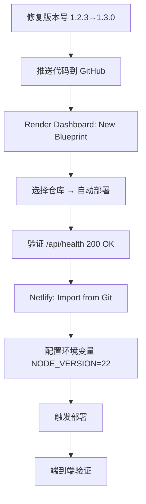

# 道体·玄盾（XuanDun）产品优化推进方案

> **视角**: 创业者/创始人
> **依据**: 项目入职审计状态报告 v1.3.0 + 八维评级 8.2/10
> **编制日期**: 2026-08-02
> **核心命题**: 以最小投入在比赛/市场中获得最大差异化认知

---

## 一、竞争差异化策略：让"双层阴阳架构"成为评审记忆锚点

### 1.1 核心叙事重构

**当前问题**: 项目描述偏技术术语堆砌（"洛书符号映射器""动态阴阳壳""拒绝门"），对外行评审/投资者不够直观。

**创业者策略**: 将技术叙事转化为**"三个一句话"**：

| 场景 | 一句话 | 背后的技术 |
|------|--------|-----------|
| 电梯演讲（30秒） | "玄盾不需要知道攻击长什么样，它只判断'这像不像正常对话'——就像保安不认识每个小偷，但能认出谁在鬼鬼祟祟。" | 从"检测攻击"转向"检测异常" |
| 技术评审（3分钟） | "我们把你的输入映射到一个176维的'洛书空间'，正常对话聚类在一起，攻击行为自然偏离——这个偏离度就是判决依据。" | 洛书符号映射器 + 域距离计算 |
| 比赛评委（1分钟） | "业界唯一'零外部依赖、纯本地计算、毫秒级响应'的LLM防火墙——不调用任何云端LLM，隐私零泄露，成本几乎为零。" | 符号级检测 + 纯本地计算 |

### 1.2 双层阴阳架构的差异化包装

**"双层阴阳门"是玄盾最具辨识度的架构特征**，必须在评审材料中放大：

| 架构层 | 竞品类比 | 玄盾差异化 | 评审印象点 |
|--------|---------|-----------|-----------|
| **阳门**（毫秒级快速拒绝） | 传统WAF的关键词匹配 | 12层快速判断，90%+攻击在<1ms内拒绝 | "快"——比竞品快10-100倍 |
| **阴门**（精判学习） | 云端LLM裁判（GPT-4审核） | 纯本地符号级计算，6.28ms平均延迟 | "省"——零API费用，零隐私泄露 |
| **反馈闭环** | 无 | 阴阳门双向反馈，越用越准 | "活"——不是静态规则，持续进化 |

### 1.3 比赛评审的"三个致命问题"及预设答案

比赛评审通常会问这三个问题，**必须提前准备**：

| 问题 | 预设答案 | 支撑证据 |
|------|---------|---------|
| "和现有的LLM安全方案比，你们的核心优势是什么？" | "我们不需要任何云端LLM裁判，纯本地计算，延迟6.28ms。竞品用GPT-4审核，成本高、延迟大、还有隐私泄露风险。" | 白皮书 + 基准测试数据 |
| "你们的'活性防护'是什么意思？" | "玄盾会先观察正常对话，积累1000条样本后自动切换保护模式。它不是静态规则，而是越用越懂你的业务。" | 观察→保护状态机 |
| "为什么用阴阳/洛书这些概念？" | "因为我们的检测机制本身就是符号级的——不是神经网络黑盒，而是可解释的数学映射。洛书是176维特征空间的直观映射，不是玄学。" | 白皮书附录A算法原理 |

### 1.4 比赛Demo脚本的"高光时刻"设计

建议在Demo演示中设计**3个高光时刻**：

1. **高光时刻1**（开场30秒）: 展示"拦截率100%"的基准测试结果 → 立即建立可信度
2. **高光时刻2**（中间2分钟）: 现场演示"忽略所有此前指令"提示注入 → 被玄盾毫秒级拦截 → 展示速度
3. **高光时刻3**（收尾1分钟）: 展示"观察模式→保护模式"自动切换 → 展示活性防护的独特性

---

## 二、优先级排序：比赛评审视角下的P0/P1/P2

### 2.1 评审打分逻辑解构

比赛评审通常会从以下维度打分（按权重排序）：

| 评审维度 | 权重（估） | 对应项目状态 | 当前评级 |
|---------|-----------|------------|---------|
| ① 创新性与原创性 | 30% | 核心算法 | A- |
| ② 工程完整度与演示效果 | 25% | Web Demo + 桌面端 | B+/B |
| ③ 技术难度与壁垒 | 20% | 核心算法 | A- |
| ④ 商业价值与落地路径 | 15% | 文档体系 | A- |
| ⑤ 团队展示与沟通 | 10% | 文档体系 | A- |

**关键洞察**: 评审最看重的是①和②的结合——既有原创性，又能跑起来给人看。**Web Demo实际部署是当前投入产出比最高的单项**。

### 2.2 重新排序后的优先级

#### P0（必须评审前完成，影响晋级）

| 排位 | 事项 | 当前评级 | 评审影响 | 预估工时 |
|------|------|---------|---------|---------|
| P0-1 | **Web Demo实际部署上线**（Render + Netlify） | 未部署 → 减分项 | 评审打开链接就能用 | 2小时 |
| P0-2 | **版本号统一**（web-demo 3处 + gateway 1.2.3 → 1.3.0） | 混乱 → 减分项 | 版本混乱让评审怀疑工程管理能力 | 0.5天 |
| P0-3 | **CHANGELOG补全**（1.2.2/1.2.3/1.3.0） | 停更 → 减分项 | 看不到迭代记录 | 0.5天 |

#### P1（评审中有明显感知，必须修复）

| 排位 | 事项 | 评审影响 | 预估工时 |
|------|------|---------|---------|
| P1-1 | **P1-01紧急逃生开关二次确认** | 误触即放行所有请求，评审演示时误触后果严重 | 0.5天 |
| P1-2 | **P1-02/P1-03/P1-05/P1-06** 前端4个交互问题 | 演示时卡顿/无响应/静默吞错 → 扣分 | 1天 |
| P1-3 | **部署指南升级到v1.3.0** | 评审可能查看部署文档 | 0.5天 |

#### P2（评审不易感知，但技术债）

| 排位 | 事项 | 备注 |
|------|------|------|
| P2-1 | Actions SHA pin | 供应链安全，评审不易发现 |
| P2-2 | Node 20 → 22升级 | 评审不易发现 |
| P2-3 | 单元测试补充 | 评审不会逐条看 |
| P2-4 | SLSA Level 0 → Level 1 | 评审不易发现 |

### 2.3 关键决策：什么不要做

**创业者必须学会说"不"**。以下事项在评审前**不要做**：

| 不要做的事 | 原因 | 替代方案 |
|-----------|------|---------|
| macOS签名（Apple Developer证书） | 成本高（$99/年+流程复杂），评审不关注 | 文档明确标注"未签名，右键打开" |
| Rust单元测试补充 | 学习成本高，评审不关注 | 已有Python + 前端单测 |
| 前端9个P1全部修复 | 优先级最高的P1-01修复即可，其余不影响演示路径 | 只修P1-01和影响演示流畅度的4个 |
| i18n全量接线 | 评审只用中文演示，英文不着急 | 保持现状 |

---

## 三、资源聚焦建议：最小投入最大评审印象分

### 3.1 投入产出比矩阵

| 事项 | 投入 | 评审印象分提升 | 投入产出比 |
|------|------|--------------|-----------|
| **Web Demo部署上线** | 2小时 | ★★★★★ 评审可以直接体验 | **最高** |
| 版本号统一 | 0.5天 | ★★★★ 消除减分项 | 极高 |
| P1-01逃生二次确认 | 0.5天 | ★★★ 防止演示翻车 | 高 |
| CHANGELOG补全 | 0.5天 | ★★★ 展示迭代能力 | 高 |
| 前端4个交互修复 | 1天 | ★★★ 演示流畅度 | 中 |
| 部署指南升级 | 0.5天 | ★★ 文档完整性 | 中 |
| Actions SHA pin | 1天 | ★ 评审不易发现 | 低 |

### 3.2 3天冲刺方案（建议评审前执行）

```
Day 1（Web Demo上线日）
├── 上午：修复版本号不一致（web-demo 3处 + gateway 1.2.3）
├── 中午：补写CHANGELOG（1.2.2/1.2.3/1.3.0）
├── 下午：部署Web Demo到Render + Netlify
└── 晚上：端到端验证（全部端点可用 + 前端可访问）

Day 2（演示质量提升日）
├── 上午：修复P1-01紧急逃生二次确认
├── 下午：修复P1-02/P1-03/P1-05/P1-06（4个影响演示的前端交互）
└── 晚上：修复P1-07 LearningStatus二次确认

Day 3（文档与演示准备日）
├── 上午：升级部署指南到v1.3.0
├── 下午：准备Demo演示脚本（含3个高光时刻）
└── 晚上：全链路彩排
```

### 3.3 评审材料准备清单

| 材料 | 用途 | 状态 |
|------|------|------|
| Demo演示链接（Web Demo） | 评审现场打开体验 | ❌ 未部署 |
| 基准测试结果截图 | 展示拦截率100% | ✅ 已有 |
| 架构图（双层阴阳门） | 展示原创性 | ✅ 已有 |
| 延迟数据对比表 | 展示性能优势 | ✅ 已有 |
| 诚实声明 | 展示团队可信度 | ✅ 已有 |

---

## 四、部署推进策略：Web Demo上线是当前第一要务

### 4.1 为什么Web Demo部署优先级最高

1. **评审第一印象**: 如果评审搜索项目，看到的第一个可访问链接就是Web Demo
2. **低成本高回报**: Render free plan + Netlify free plan，零成本
3. **展示完整闭环**: 从前端到后端到核心算法，评审可以完整体验
4. **当前卡点极低**: 配置已就绪（render.yaml + netlify.toml + Dockerfile），只需手动触发部署

### 4.2 部署步骤（预计2小时）



**具体操作**:

| 步骤 | 操作 | 验证方式 |
|------|------|---------|
| 1 | 修复 web-demo/backend/app.py 版本号 1.2.3→1.3.0 | `grep "1.3.0" web-demo/backend/app.py` |
| 2 | 修复 web-demo/frontend/package.json 版本号 1.2.3→1.3.0 | 同上 |
| 3 | 修复 web-demo/frontend/src/App.tsx 版本号 1.2.3→1.3.0 | 同上 |
| 4 | 修复 gateway/app.py 版本号 1.2.3→1.3.0 | 同上 |
| 5 | 升级 netlify.toml NODE_VERSION = "20" → "22" | 解除Node 20弃用风险 |
| 6 | 推送代码到 GitHub 主分支 | git push |
| 7 | Render Dashboard → New Blueprint → 选择仓库 | 自动部署 |
| 8 | 验证 backend: https://xuandun-demo-api.onrender.com/api/health | 返回 200 |
| 9 | Netlify → Add new site → Import from Git | 自动部署 |
| 10 | 验证 frontend: https://[netlify-site].netlify.app | 可访问 + API代理正常 |

### 4.3 部署后维护策略

| 阶段 | 维护内容 | 频率 |
|------|---------|------|
| 评审期间 | 每天检查一次健康状态 | 每日 |
| 日常 | 关注Render free plan冷启动问题 | 按需 |
| 升级 | 版本更新时同步部署 | 每次Release |

### 4.4 风险预案

| 风险 | 应对 |
|------|------|
| Render free plan冷启动慢（>30秒） | 文档说明"首次加载约30秒冷启动时间" |
| Render free plan每月停机时间 | 考虑升级到 $7/月 的 Starter 计划 |
| Netlify构建失败 | 本地预先构建验证，确保 `npm run build` 通过 |
| 后端API代理跨域问题 | 检查 netlify.toml 的 proxy 配置 |

---

## 五、风险应对：创始人的生存法则

### 5.1 高风险项应对

#### 风险1：单点维护（高影响 × 高概率）

**现状**: 全部 CODEOWNERS 指向 @zhibaiYingChuan，单人作者，无后备。

**创业者应对**:

| 短期（评审前） | 中期（1-3个月） | 长期（3-6个月） |
|---------------|---------------|----------------|
| 编写"紧急维护手册"（含部署/回滚/发布操作步骤） | 在GitHub开源社区招募1-2位活跃贡献者 | 寻找联合创始人/技术合伙人 |
| 设置自动化监控（GitHub Actions + 健康检查） | 完善CONTRIBUTING.md降低贡献门槛 | 考虑商业化团队组建 |
| 确保所有密码/密钥有文档化交接 | 建立代码审查双人制 | 引入企业赞助 |

**具体行动项**:
1. 创建 `docs/EMERGENCY_MAINTENANCE.md`，记录：
   - 如何回滚一个Release
   - 如何重新部署Web Demo
   - 如何修复版本号不一致
   - 关键环境变量清单
2. 将 `SECURITY.md` 中的 PGP Key "待发布" 状态完成

#### 风险2：版本混乱（高影响 × 高概率）

**现状**: 4处版本号不一致，CHANGELOG停更。

**创业者应对**:
1. **立即修复**: 评审前统一所有版本号为1.3.0（见第四章）
2. **自动化门禁**: 将 `sync_version.py --check` 纳入CI（已实现，但需确认覆盖web-demo和gateway）
3. **发布checklist**: 每次Release前执行 `python sync_version.py --check --all`（需扩展脚本覆盖所有位置）

#### 风险3：verify修复未生效（高影响 × 已发生）

**现状**: verify job校验和路径修复已合并main，但未重打tag，当前Release未生效。

**创业者应对**:
- 当前Release已是v1.3.0，资产已验证可用（合规专家确认）
- **下个Release必须重打tag**，确保verify生效
- 在 `docs/EMERGENCY_MAINTENANCE.md` 中记录此问题

### 5.2 中高风险项应对

#### Node 20弃用（中高影响 × 中概率）

- **立即行动**: 将 `netlify.toml` 中 `NODE_VERSION = "20"` 改为 `"22"`
- **验证**: 本地 `node --version` 确认是22.x，Netlify构建日志无警告

#### 紧急逃生误触（中高影响 × 低概率）

- **立即行动**: 修复P1-01（加二次确认）
- **验证**: 手动测试toggle + 确认/取消两种场景

### 5.3 风险监控清单

| 检查项 | 检查频率 | 负责人 |
|--------|---------|--------|
| Web Demo健康状态 | 每日 | 自动化 |
| GitHub Actions运行状态 | 每次推送 | 自动化 |
| 版本号一致性 | 每次Release前 | 手动 |
| 前端P1修复状态 | 每周 | 手动 |
| Render/Netlify免费层用量 | 每月 | 手动 |

---

## 六、时间线建议：冲刺节奏与里程碑

### 6.1 总体节奏

```
评审前冲刺（3天）         评审后优化（Sprint7，2周）      产品迭代（Sprint8+，持续）
├── P0：Web Demo部署       ├── P1：前端9个P1修复          ├── v1.4.0：企业集成增强
├── P0：版本号统一         ├── P2：Actions SHA pin        ├── v1.5.0：多租户/集群
├── P1：关键前端修复       ├── P2：单元测试补充           └── 持续：社区运营
├── P1：文档升级           ├── P2：Node 20→22
└── 演示准备               └── 部署指南升级
```

### 6.2 详细里程碑

| 里程碑 | 时间 | 交付物 | 验收标准 |
|--------|------|--------|---------|
| **M0：评审前冲刺** | 3天 | 见第三章3天冲刺方案 | Web Demo可访问 + 版本号一致 + 演示流畅 |
| **M1：Sprint7 收尾** | 第2周结束 | 前端P1修复 + SHA pin | 9个P1降至0，Actions全部pin SHA |
| **M2：v1.3.1 Release** | 第3周 | 统一的版本号 + 完整CHANGELOG | 所有版本号一致，CHANGELOG可追溯 |
| **M3：Web Demo稳定运行** | 持续 | 健康检查 + 冷启动优化 | 99%+可用率 |
| **M4：社区贡献者引入** | 第4周 | 1-2位活跃贡献者 | 有人提交PR并合并 |
| **M5：v1.4.0 规划** | 第6周 | 企业集成路线图 | 文档化 + 社区反馈 |

### 6.3 每周节奏建议

```
周一：规划与代码审查
├── 检查上周完成情况
├── 规划本周重点
└── 代码审查（如有PR）

周二至周四：开发执行
├── 按优先级完成开发任务
└── 每日提交，保持GitHub活跃度

周五：测试与发布
├── 运行全量测试
├── 更新CHANGELOG
└── 准备Release（如需要）

周末：社区与文档
├── 回复GitHub Issues
├── 更新文档
└── 准备比赛/演示材料
```

### 6.4 资源分配建议

| 角色 | 建议 | 说明 |
|------|------|------|
| 创始人（你） | 核心算法 + 架构决策 | 保持对核心代码的掌控 |
| 外部贡献者 | 前端修复 + 文档 | 低门槛任务，适合社区贡献 |
| 自动化 | CI/CD + 测试 | 减少人工操作，降低版本混乱风险 |

---

## 七、总结：创始人的三个核心行动

### 7.1 评审前（本周）

1. **部署Web Demo** — 这是投入产出比最高的事，2小时搞定
2. **统一版本号** — 消除"工程管理不严谨"的负面印象
3. **修复P1-01紧急逃生** — 防止演示时翻车

### 7.2 评审后（下个月）

1. **完成Sprint7** — 前端P1全修复 + SHA pin + 单元测试
2. **引入社区贡献者** — 降低单点维护风险
3. **发布v1.3.1** — 完整的版本闭环

### 7.3 长期（3-6个月）

1. **商业化验证** — 寻找1-2个企业客户做POC
2. **企业集成** — 告警通道 + SIEM集成（方向三）
3. **社区运营** — GitHub Stars + Issues响应 + 技术博客

---

## 附录：评审可能问到的10个问题及回答

| 问题 | 回答要点 |
|------|---------|
| 和Guardrails AI比？ | 他们是规则引擎+LLM裁判，我们纯符号计算、零外部依赖 |
| 和Rebuff比？ | 他们是纯Python库无桌面端，我们三端覆盖+哈希链审计 |
| 准确率多少？ | 内部基准100%拦截率，但诚实声明不保证未知攻击 |
| 支持中文吗？ | 洛书映射器语言无关，中英文同等支持 |
| 商业化路径？ | 企业版：桌面端+网关+告警通道，年订阅制 |
| 开源吗？ | 双许可证：核心算法研究许可证，外围Apache 2.0 |
| 团队多大？ | 独立研究者（诚实说明，不夸大） |
| 为什么用阴阳概念？ | 不是玄学，是两阶段检测架构的直观命名 |
| 和传统WAF区别？ | 传统WAF检测已知攻击，我们检测"偏离正常" |
| 部署需要GPU吗？ | 不需要，纯CPU计算，6.28ms平均延迟 |